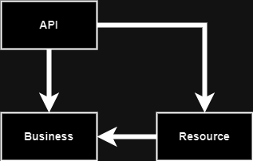

# Vedrid - Portfolio Project

The app browses Icelandic weather data from https://www.vedur.is/um-vi/vefurinn/xml/
This app is only designed for the all green path and is not handling errors that might come up.

## Vedrid solution

The project consists of 2 parts, a nextjs react web and a dotnet 7 minimal api.

To launch the project with docker go to the root directory of the project and execute `docker compose up` that will launch the UI on http://localhost:3000 and the API on http://localhost:5000

Some basic api operations can be seen and interacted with in the following vs code rest client file once the containers are running:

[veduris.http](Documentation/veduris.http)

Its probably best to use the Swagger UI to test from http://localhost:5000

## The Api Project

The API is separated into 3 projects. API, Business And Resource layers. The API project is a dotnet minimal api project, it's more of a node/express like setup. Its handy when trying to do things fast but it can get a little messy compared to web API. But with a little work its probably possible to clean it up.

We are using dependency Injection in solutions so its easy to unit and resource test. There is a basic resource test project. I did not add a unit test project because i don't have much business logic.


## Project Milestones/Features

### A priority tasks

* [X] Setup Documentation
* * [x] Configuration
* * [x] Project Structure
* * [x] External Resources
* [X] Setup Project boilerplate + repository
* * [x] editorconfig
* * [x] gitignore, dockerignore
* * [x] swagger
* * [X] DockerFiles and compose
* [X] Research integration endpoint and create a design
* [X] Implement Resource
* [X] Implement Service layer
* [x] Implement Resource Tests
* [x] Implement API Integration Tests
* [x] Implement API Layer
* [ ] Code cleanup/refactoring

### B priority tasks
* [ ] Finish the react client so that is fetches data from the api
* [ ] Research nextjs api layer
* [ ] Setup Serilog
* [ ] API sentry logging
* [X] API Healthcheck
* [ ] AWS Deployment
* [ ] Github Actions build
* [ ] Add database?
* [ ] Scrape site for stations and store in DB
* [ ] Test Mini profiler. https://miniprofiler.com/

## Tools

* The boilerplate for the front end we get from next.js it's a fairly popular react scaffolding system. 
https://nextjs.org/

* We will use dotnet core minimal api as a backend to fetch data from vedur.is to pass data to the frontend.
https://learn.microsoft.com/en-us/aspnet/core/tutorials/min-web-api?view=aspnetcore-7.0&tabs=visual-studio-code

# vedur.is resource

To start i would like to say the [documentation from vedur.is](https://www.vedur.is/media/vedurstofan/XMLthjonusta.pdf) could be better. We can't get a list of ids from a web service call, we have to scrape or manually get ids from the website. But we will write some documentation here on what we discover about the resource and how we are going to use it.

## The Request
How are we going to get the data we want? We have a few options. We start with a basic request and then we want to add maybe 1 or 2 optional parameters to get different results from the service.

Check out the http [vscode rest client](https://marketplace.visualstudio.com/items?itemName=humao.rest-client) file to test the endpoint yourself: [veduris.http](Documentation/veduris.http)

BasePath with required parameters: 

https://xmlweather.vedur.is?op_w=xml&type=forec&lang=is&view=xml&ids=1;422

### Parameters

####  Ids - weather station ids

*Parameter to add to path*  `&ids=1;422;2642`

Source data: https://www.vedur.is/vedur/stodvar

Since we can cant get a list of ids we will just list a few popular places.

| ID | Description |
| -- | -- |
| 1 | Reykjavík |
| 2642 | Ísafjörður |
| 422 | Akureyri |
| 571 | Egilsstaðir |
| 5544 | Höfn í Hornafirði |

#### Lang

*Parameter to add to path*  `&lang=is`

Language is ``is`` for icelandic or ``en`` english.

#### Type - forcast type

*Parameter to add to path*  `&type=forec`

What type of forecast does the user want? we will only use forc. changing type we change the return object completely.

| Type | Description |
| ---  | -- |
| obs | Veðurathuganir |
| forec | Sjálfvirkar veðurspár  |
| txt | Textaspár og lýsingar |
| forec-info | Upplýsingar um ve| ðurspálíkön |

#### Time (optional) - how many hours to predict

*Parameter to added to path* `&time=1h`

Time between measurements is always in hours. For automatic measurements 1h is common. Fer manned posts its more likely to jump every 3h.

Default value = **"1h"**

#### Params - what data to show   

Here we can filter all kinds of parameters we want returned to us. Not every parameter is returned for every type.

| Tákn | Mælistærð og eining |
|-|-|
| F | Vindhraði (m/s) |
| FX | Mesti vindhraði (m/s) |
| FG | Mesta vindhviða (m/s) |
| D | Vindstefna (sjá lista af skammstöfunum aftar í skjalinu) |
| T | Hiti (°C) |
| W | Veðurlýsing (sjá lista af lýsingum aftar í skjalinu) |
| V | Skyggni (km) |
| N | Skýjahula (%) |
| P | Loftþrýstingur (hPa) |
| RH | Rakastig (%) |
| SNC | Lýsing á snjó |
| SND | Snjódýpt (cm) |
| SED | Sjólag |
| RTE | Vegahiti (°C) |
| TD | Daggarmark (°C) |
| R | Uppsöfnuð úrkoma (mm / klst) úr sjálfvirkum mælum. |

#### Weather Description(W) values

Mögulegar veðurlýsingar í veðurathugunum og veðurspám.  

| Á íslensku | Á ensku |
|--|--|
| Heiðskírt | Clear sky |
| Léttskýjað | Partly cloudy |
| Skýjað | Cloudy |
| Alskýjað | Overcast |
| Lítils háttar | rigning Light rain |
| Rigning | Rain |
| Lítils háttar slydda | Light sleet |
| Slydda | Sleet |
| Lítils háttar snjókoma | Light snow |
| Snjókoma | Snow |
| Skúrir Rain | showers |
| Slydduél | Sleet showers |
| Snjóél | Snow showers |
| Skýstrókar | Dust devil |
| Moldrok | Dust storm |
| Skafrenningur | Blowing snow |
| Þoka | Fog |
| Lítils háttar súld | Light drizzle |
| Súld | Drizzle |
| Frostrigning | Freezing rain |
| Hagl | Hail |
| Lítils háttar þrumuveður | Light thunder |
| Þrumuveður | Thunder |


## The Response 
What data are we going to be displaying?

``` XML
<?xml version="1.0" encoding="UTF-8"?>
<forecasts>
  <station id="1"  valid="1">
    <name>Reykjavík</name>
    <atime>2023-11-14 06:00:00</atime>
    <err></err>
    <link>
      <![CDATA[http://www.vedur.is/vedur/spar/stadaspar/hofudborgarsvaedid/#group=100&station=1]]>
    </link>
    <forecast>
      <ftime>2023-11-14 07:00:00</ftime>
      <F>9</F>
      <D>A</D>
      <T>6</T>
      <W>Alskýjað</W>
    </forecast>
    <forecast>
      <ftime>2023-11-14 08:00:00</ftime>
      <F>9</F>
      <D>A</D>
      <T>5</T>
      <W>Alskýjað</W>
    </forecast>
    ...
<forecasts>
```

## Api Design

Vedrid API documentation

## Get list of forecasts

### Request

`GET /weather-forecasts?ids={ids:all}&time={time:1}&lang={lang:is}`

    curl -i -H 'Accept: application/json' http://localhost:5000/forecasts

### Response 

    HTTP/1.1 200 OK
    Date: Thu, 24 Feb 2011 12:36:30 GMT
    Status: 200 OK
    Connection: close
    Content-Type: application/json
    Content-Length: 2

    {
        "stations": 
        [
            {
                "id": 1,
                "name": "Reykjavík",
                "fromTime","2023-11-14 06:00:00"
                "forecasts": 
                [
                    {
                        "time": "2023-11-14 08:00:00"
                        "temperature": 5,
                        "windSpeed": 9,
                        "windDirection": "East"
                        "weatherDescription": "Cloudy"
                    },
                    ...
                ]
            },
            ...
        ]
    }

## Get list of Weather stations

### Request

`GET /weather-stations`

    curl -i -H 'Accept: application/json' http://localhost:5000/weatherstations

### Response 

    HTTP/1.1 200 OK
    Date: Thu, 24 Feb 2011 12:36:30 GMT
    Status: 200 OK
    Connection: close
    Content-Type: application/json
    Content-Length: 2

    {
        "WeatherStations": 
        [
            {
                "id": 1,
                "name": "Reykjavík"
            },
            ...
        ]
    }

## Configuration

The only configuration needed is the connection string for vedrid.is

## Project structure

We have 3 main projects and 2 test projects

The 3 main projects splitt the code into API, Business and Resource layer.
* Api layer implements the outwards facing api the customers consumer.
* The service layer handles all business logic need to perform on the data that the customer requests.
* The Resource layer fetches and pushes data to external resources for the customer.

The project depency graph looks like this. Its simple but very important. So we dont get in trouble working with models and with dependency injection.



Then there are 2 test project Implementation tests and Resource test.
* Implementation test help us keep the API in a correct state and that it works as designed. There should be mock resources but i've not created mocks for now. Tests cannot run automatically without mock resources.
* Resource tests help us integrate with external resources and should not be run automatically.
* Business/Unit tests are missing because there is no business logic.

# Project build notes and references

## Generate class from XML

As described here https://stackoverflow.com/a/4203551 creating a class from an xml document is easy. 

Visual studio installation is required. It's easiest to install the community version. OR you might have it and need to add the correct folder to **environmental path**

```
C:\Program Files (x86)\Microsoft SDKs\Windows\{version}\bin\NETFX {version} Tools\
```

We first create an XSD definition: `c:\path> xsd ExampleResponse.xml`

Then we create the class: `c:\path> xsd ExampleResponse.xsd /classes`

## Parse xml string to object

https://stackoverflow.com/a/19613953/1761867

## Using dotnet http client

https://learn.microsoft.com/en-us/dotnet/core/extensions/httpclient-factory

https://www.infoq.com/articles/creating-http-sdks-dotnet-6/?fbclid=IwAR3Vaz1fugpLYwt2Phep2GQs4AtSTZv28Mv8tGQzLr7BOULahXSufwdCfgY

## Adding swagger to minimal api

https://learn.microsoft.com/en-us/aspnet/core/fundamentals/minimal-apis/openapi?view=aspnetcore-7.0

## Adding healthchecks

https://github.com/Xabaril/AspNetCore.Diagnostics.HealthChecks#Health-Checks
https://learn.microsoft.com/en-us/aspnet/core/host-and-deploy/health-checks?view=aspnetcore-8.0
https://blog.devart.com/how-to-implement-health-checks-in-asp-net-6.html


## Reusable integration testing

https://timdeschryver.dev/blog/how-to-test-your-csharp-web-api#a-custom-and-reusable-xunit-fixture

```bash
dotnet add package Microsoft.AspNetCore.Mvc.Testing -v 7.0.14
dotnet add package FluentAssertions -v 6.12.0
```

Vedrid.csproj
```xml
  <ItemGroup>
    <InternalsVisibleTo Include="Vedrid.IntegrationTests" />
  </ItemGroup>
```